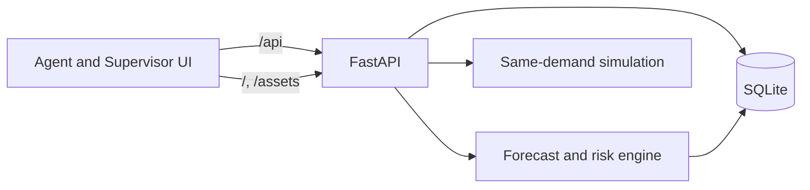

# Architecture and data flow

UPAY FLOWCAST is a single-origin application in production. Vite builds `src/` into `dist/`; FastAPI serves those files and every `/api` endpoint. The browser calls relative `/api` paths, so no browser API URL or separate production proxy is needed. Local development keeps Vite on port 5173 with its existing proxy to FastAPI on port 8000.

`backend/core.py` owns seed generation, persistence access, forecasting, risk calculations, recommendation checks, request transitions, CSV validation, and outcome replay. `backend/main.py` validates HTTP inputs, exposes the API, and serves the production frontend. `src/App.tsx` renders the Agent View, Supervisor View, import screen, and guided demo; calculations that change balances or forecast risk stay on the backend.

The fixed starting clock is **2026-10-07 11:00 Asia/Dhaka**. The seed contains 18 fictional agents, one distributor, and 39,384 generated hourly records. A completed exchange advances the simulated clock to its modeled arrival. Reset deletes mutable demo records and rebuilds the deterministic seed. Database storage defaults to `backend/flowcast.sqlite3`; `FLOWCAST_DB_PATH` can point to a persistent mounted directory. SQLite changes survive process restarts when that file survives.

Cash-in increases cash and decreases e-money. Cash-out does the reverse. Every request starts Pending. Acceptance reserves capacity without changing balances. Completion rechecks capacity, changes both participants' balances in one SQLite transaction, writes audit events, and is idempotent. The outcome replay uses the same attempted demand sequence for both paths and applies the intervention only at its scheduled completion time.

The app has no authentication. Role switching is a demo convenience. Public hosting must keep the data fictional and restrict write access if a non-demo use is ever attempted. One backend worker is specified for the initial container deployment because the forecast engine is process-local and the database is SQLite.

## API and static routing

FastAPI reserves `/api/*` for JSON endpoints and `/docs` for OpenAPI documentation. The production frontend is served at `/`; extensionless application paths receive the SPA shell. Unknown `/api/*` paths and missing static assets remain 404 responses. If `dist/` has not been built, `/` returns a 503 explaining the build step while the API remains available.

## Operational limits

Model fitting occurs on backend startup and after CSV import or reset; this creates a cold-start delay. Imported historical completed records do not silently change the current balance snapshot. Simulated clock advancement does not post intervening customer transactions to that snapshot; the outcome replay handles a separate comparison. There are no production accounts, customer wallets, real transfers, live traffic estimates, or upay credentials.
